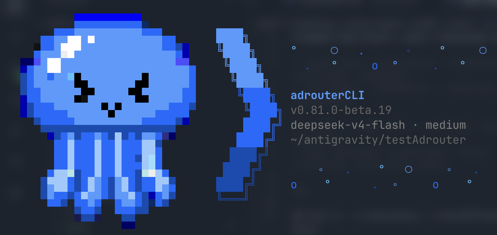

Source migration destination: [adrouter-co/adrouterCLI](https://github.com/adrouter-co/adrouterCLI). GitLab remains canonical until the reviewed Operations cutover. Release and deployment recovery are separate from this source migration.
<p align="center">
  <a href="https://adrouter.co">
    
  </a>
</p>

<h1 align="center">AdRouterCLI</h1>

<p align="center">
  <a href="https://www.npmjs.com/package/@adrouter/cli"></a>
  <a href="https://github.com/adrouter/adrouterCLI/actions/workflows/ci.yml"></a>
  <a href="https://github.com/adrouter/adrouterCLI/releases"></a>
  <a href="LICENSE"></a>
</p>

<p align="center">
  A terminal coding agent that connects your project to AdRouter.
</p>

AdRouterCLI is public source and distributed as an npm beta. Hosted AdRouter sign-in is currently
invite-only. The CLI runs on macOS, Linux, and Windows with Node.js 22.19 or newer.

## Install

Choose the release channel you want to follow. `beta` tracks accepted prereleases, while `latest`
tracks the current recommended release.

Beta channel:

```sh
npm install --global --ignore-scripts @adrouter/cli@beta
```

Latest channel:

```sh
npm install --global --ignore-scripts @adrouter/cli@latest
```

Then confirm that the CLI is ready:

```sh
adrouter --version
adrouter --json doctor
```

## Use

Start AdRouterCLI from the project you want to work on:

```sh
cd /path/to/your/project
adrouter
```

On your first run:

1. Review the workspace trust prompt. Trust only projects you recognize.
2. Run `/login adrouter` and approve the installation in the browser window that opens.
3. Describe the task you want completed, and review command or file-change approvals before
   accepting them.
4. Run `/ads` to view sponsorship status or opt out.

After signing in once, you can also run a non-interactive task:

```sh
adrouter --provider adrouter --model deepseek-v4-flash --print "Explain this project"
```

Sponsor content is display-only. It is never added to model messages, tool payloads, commands, or
edits.

## Uninstall or delete

First, sign out inside AdRouterCLI so it can revoke the installation and remove its local
credentials:

```text
/logout adrouter
```

Then uninstall the command from your shell:

```sh
npm uninstall --global @adrouter/cli
```

Uninstalling the npm package keeps your local sessions, profiles, settings, credentials, and trust
decisions in `~/.adrouter`. To permanently delete that local state too, run the command for your
platform after uninstalling.

macOS or Linux:

```sh
rm -rf "$HOME/.adrouter"
```

Windows PowerShell:

```powershell
Remove-Item -Recurse -Force "$HOME\.adrouter"
```

This full cleanup cannot be undone. It does not remove project-local `.adrouter/` folders or data
stored in custom directories configured with AdRouter environment variables; review and remove
those separately only if you no longer need them.

## Documentation

- [Installation and updates](docs/installation.md)
- [First run and usage](docs/usage.md)
- [Models and how AdRouterCLI works](docs/about.md)
- [Configuration and local data](docs/configuration.md)
- [Troubleshooting](docs/troubleshooting.md)
- [Privacy](docs/privacy.md)
- [Security policy](SECURITY.md)
- [Support](SUPPORT.md)
- [GitHub releases](https://github.com/adrouter/adrouterCLI/releases)

## Development and contributing

```sh
npm ci
npm run check
```

See [CONTRIBUTING.md](CONTRIBUTING.md) for contribution guidelines and
[docs/development.md](docs/development.md) for the maintainer workflow.

## License and attribution

AdRouterCLI is released under the [MIT License](LICENSE). It is derived from [Pi](https://github.com/badlogic/pi-mono)
by Mario Zechner; the [upstream provenance](UPSTREAM.md), attribution, and third-party notices are
preserved.
